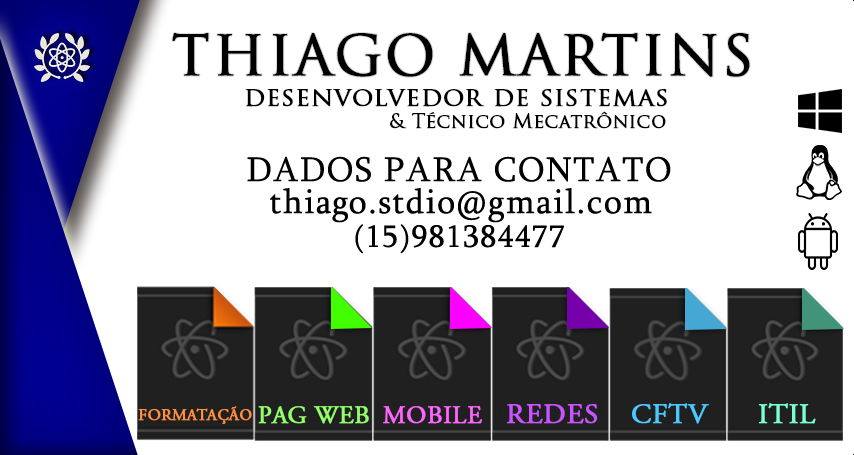

# SITE - Template FREE do site Criado pelo departamento Stdio
## Cartão Visita incluindo o site do github pages com o DNS apontado para http://stdiocomunicacao.tk/

## Cartão Visita

 ♥ Thiago Carvalho Martins

[@ThiagoStdio](https://www.instagram.com/thiagostdio/) – Instagram 

[Thiago Carvalho DevOps](https://www.linkedin.com/in/thiago-c-621365175/) – LinkedIn 

[Thiago Carvalho Martins](https://www.facebook.com/password.iso.27001/) – Facebook  

[Repositório GitHub](https://github.com/ThiagoStdio?tab=repositories) – Repositório 

<!-- Markdown link & img dfn's -->
[XAMARIN]: https://img.shields.io/badge/XAMARIN-TRUE-white
[Teste de usabilidade]: https://img.shields.io/badge/TestedeUsabilidade-OK-black
[DOWNLOADS]: https://img.shields.io/badge/Downloads-X-cyan
[JAVA]: https://img.shields.io/badge/JAVA-TRUE-pink
[CSS]: https://img.shields.io/badge/CSS-TRUE-green
[HTML]: https://img.shields.io/badge/HTML-TRUE-blue
[PHP]: https://img.shields.io/badge/PHP-TRUE-red
[FP]: https://img.shields.io/badge/FernandoPrestes-FLAG-yellow
[ARDUINO]: https://img.shields.io/badge/Arduino-UNO-yellowgreen
[CS]: https://img.shields.io/badge/C-Sharp-cyan
